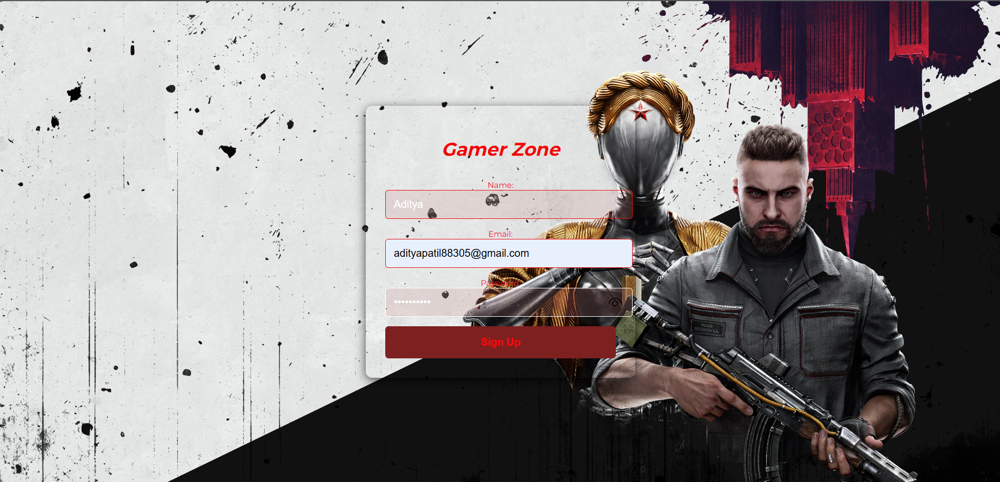
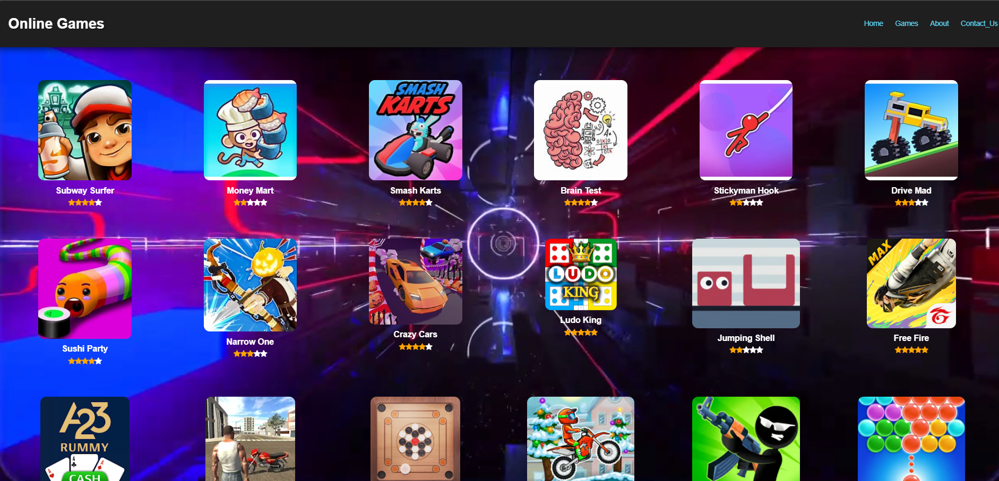
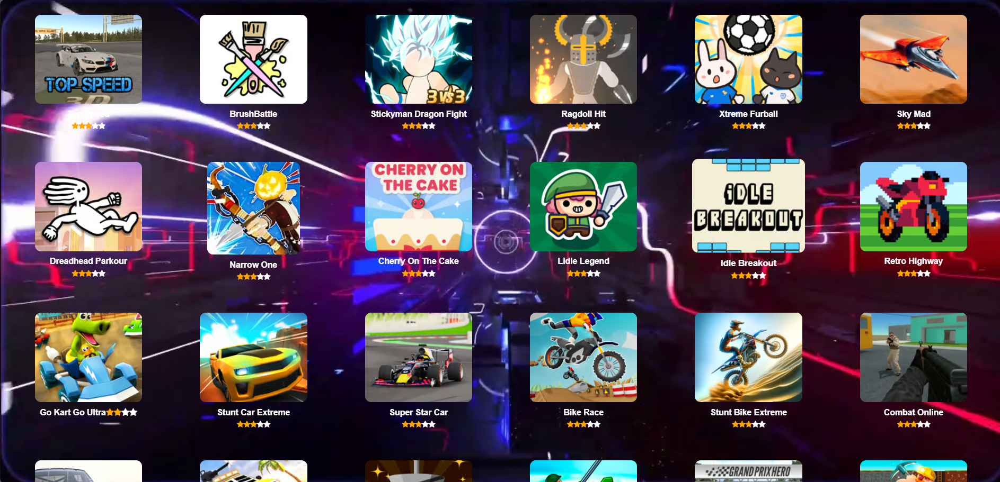
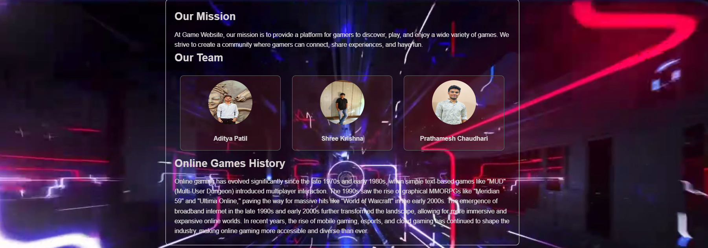

# Online Gaming Website

This project is a **frontend demo of an online gaming website** developed as a **group mini project** for a **Web Development course** using **HTML, CSS, and basic JavaScript**.  
The main objective of this mini project is to practice and demonstrate core web development concepts such as layout design, responsive UI, styling, and basic client-side interaction while working collaboratively in a team environment.

The website features a **modern and visually engaging interface**, including a **login/sign-up page**, a **game showcase section** with multiple game cards, star ratings, and external game links. A **background video** is used to enhance the overall gaming experience and make the UI more dynamic and immersive.

The project is completely **static** and does not include any backend or database functionality. Form validation is handled using **basic JavaScript**, and navigation is implemented using standard HTML elements.

This project is ideal for:
- Students completing a **Web Development mini project**
- Beginners learning **HTML, CSS, and basic JavaScript**
- College students working on **group projects**
- Developers building a **frontend portfolio**

---

## Features

- Responsive and modern UI design  
- Login / Sign-up page with basic form validation  
- Gaming dashboard with multiple game cards  
- Star rating display for games  
- Background video for immersive effect  
- Clean and structured layout  
- External links to games  

---

## Screenshots

### Login Page

### Home Page

### Game Showcase Section

### About Section

### Contact Section

---

## Technologies Used

- HTML
- CSS
- JavaScript (basic form validation)  

---

## Team Members

- Aditya Patil  
- ShreeKrishna  
- Prathamesh Chaudhari  

---

## Project Purpose

This mini project was created as part of a **Web Development course** for **learning and demonstration purposes**.  
It does not include real authentication, backend services, or databases.

---

## How to Run the Project

1. Download or clone the repository  
2. Open `online_gaming_login_page.html` in any modern web browser  
3. Navigate through the website using the UI  

---

## Future Improvements

- Add backend authentication  
- Improve responsiveness for all screen sizes  
- Add JavaScript-based interactivity  
- Convert into a full-stack gaming platform  

---

## Disclaimer

All game images, logos, and external links belong to their respective owners.  
This project is for educational use only.
